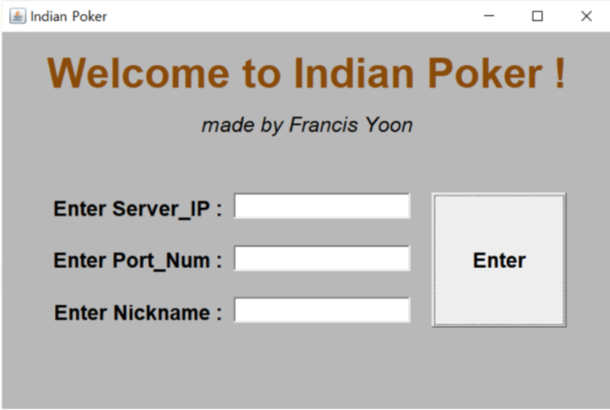
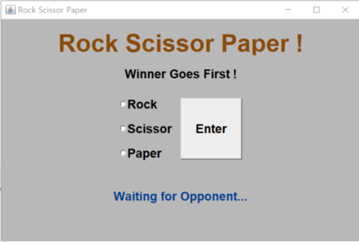
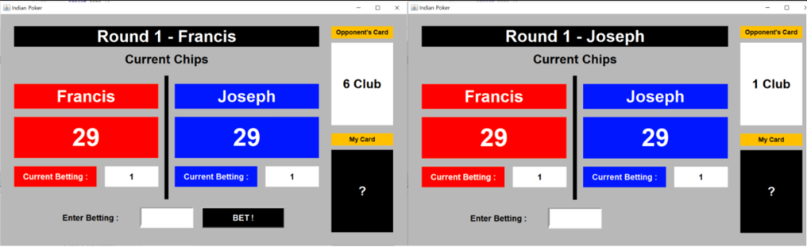

# 2-Player-Indian-Poker
같은 네트워크에 접속해 있는 두 컴퓨터 간의 소켓 통신을 통해 ‘더
지니어스’의 ‘인디언 포커’를 Java AWT GUI로 구현한 게임입니다.
서버를 구축하고 포트 포워딩을 하면 로컬 네트워크가 아닌 전세계의 사람들과 게임을 즐길 수 있습니다.

## 게임 방법
1. GUI_Server.java를 실행하여 서버를 구축합니다.
2. GUI_Player1.java (혹은 GUI_Player2.java)를 실행합니다.
3. 시작창에서 Server_IP와 Port_Num을 입력하고 닉네임을 설정하여 서버에 접속합니다.

4. 두 플레이어가 모두 접속하면 가위바위보 창으로 넘어갑니다.

5. 가위바위보 승패가 결정되면 선공/후공이 결정된 채로 인디언 포커 창으로 넘어갑니다.

6. 매 라운드마다 기본 배팅금액(칩 1개)이 지불됩니다. 각 플레이어는 상대방의 카드를 확인하고 배팅을 이어나갑니다. 배팅 규칙은 다음과 같습니다.
   * 포기: 이때, 10을 들고 포기를 하게 되면 패널티로 상대방에게 10개의 칩이 넘어갑니다.
   * 상대방의 배팅 금액과 맞추기: 배팅이 종료됩니다.
   * 상대방의 배팅금액보다 더 높게 배팅하기: 상대방이 배팅할 차례가 됩니다.
7. 배팅이 종료되면 패가 공개되고, 패의 숫자가 높은 플레이어가 승리하여 쌓인 칩을 모두 가져갑니다.
8. 한 플레이어의 칩이 모두 소진되면 게임이 종료됩니다.
